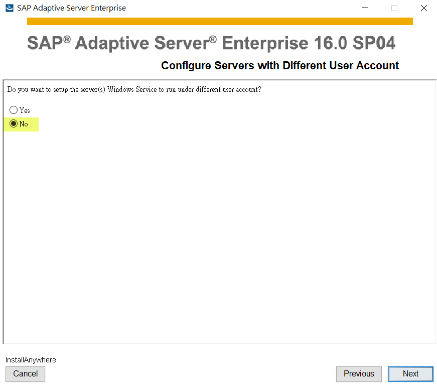
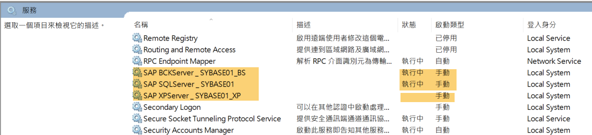
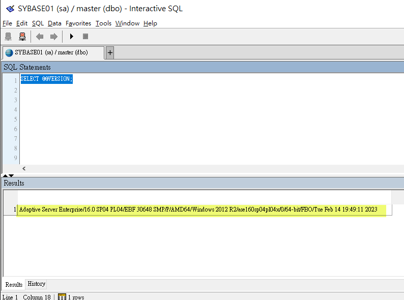
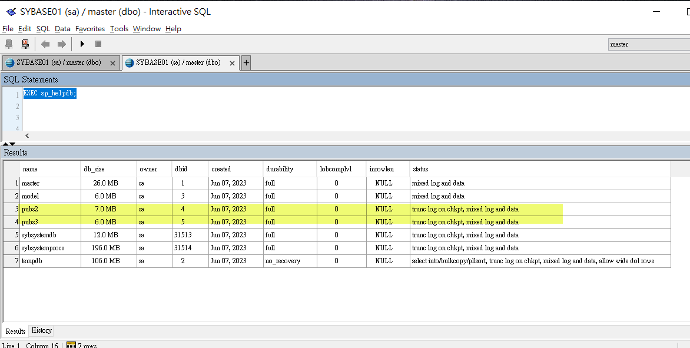

# 如何在 Windows 10 安裝 SAP ASE 16.0

* [1. 前言](#1-前言)  
* [2. 開發環境](#2-開發環境)  
* [3. 安裝過程](#3-安裝過程)  
  * [3.1 一般說明](#31-一般說明)  
  * [3.2 安裝模式](#32-安裝模式)  
  * [3.3 複製軟體](#33-複製軟體)
  * [3.4 進行組態設定](#34-進行組態設定)
  * [3.5 開始真正安裝](#35-開始真正安裝)
  * [3.6 安裝完成](#36-安裝完成)
  * [3.7 測試一下](#37-測試一下)
* [4. 結論](#4-結論)  
* [5. 參考文件](#5-參考文件)  

## 1. 前言
由於專案資料整合的需求, 需連接至原有 SAP ASE 16.0 進行資料存取, 因此先行在自己筆電建立虛擬機器 (VM), 安裝 SAP ASE 16.0. 所謂的 ASE (Adaptive Server Enterprise) 其實就是 Sybase. 
Sybase 在 20 幾年前是蠻好的資料庫, 採用 PowerBuilder 開發應用程式, 而且又能與 IBM CICS/COBOL 整合.  當時資料庫的三大供應商是 Oracle / Sybase / Informix, 後來 Sybase 被 SAP 收購, Informix 被 IBM 收購; 筆者目前常接觸的, 大概是 MSSQL (與 Sybase 同源),  Oracle 及 MariaDB (or 付費版的 MySQL).  

## 2. 安裝環境
* Windows 10 22H2 Professional Edition  
* Oracle VirtualBox 7.0.6  
  * Windows 10 2004 Professional Edition  
  * .NET Framework 3.5 / 4.8  
  * Java Runtime 8u371  
  * Java Sdk 8u371  
    * 環境變數
    * JAVA_HOME   C:\Program Files\Java\jdk-1.8
    * JRE_HOME    C:\Program Files\Java\jre-1.8
    * PATH        C:\Program Files\Java\jre-1.8\bin;%PATH%
  * Microsoft Visual C++ 2010 Redistribution  
  * Microsoft Visual C++ 2015 and later Redistribution  

## 3. 安裝過程

### 3.1 一般說明

* setup.exe 要以系統管理員身份執行  
* 全部都是預設值, 只是為了測試, 所以, 密碼均固定同一組 (但要至少 8 個字元)  
* [V] Create Sample Database  
* Cockpit 不為 Windows Service  
* 遇到網路授權頁面時, 都是 [V]私人, [ ]公用  

### 3.2 安裝模式
固定為 Typical.  
  

### 3.3 複製軟體
  
  

### 3.4 進行組態設定
組態項目: SAP ASE / Backup Server / Configure Cockpit  
  
  
  
  
組態彙總  
  
  
  

### 3.5 開始真正安裝
  
  
  
  

### 3.6 安裝完成
  
  

### 3.7 測試一下
以 Interactive SQL 進行測試  
  
  

```sql
SELECT @@VERSION

-- output:
-- Adaptive Server Enterprise/16.0 SP04 PL04/EBF 30648 SMP/P/AMD64/Windows 2012 R2/ase160sp04pl04x/0/64-bit/FBO/Tue Feb 14 19:49:11 2023
```
  

```sql
EXEC sp_helpdb;
-- output:
-- pubs2, pubs3 為範例資料庫
```
  


## 4. 結論 
經由一連串試誤的過程, 在缺乏支援的狀況下, 花費了不少時間. 但終究還是安裝了可以運作的 ASE 16.0.  
由於 ASE 16.0 提供的管理工具, 不是不提供下載, 不然就是安裝失敗, 下一篇將利用 DBeaver Community Edition 連接到 ASE 16.0 進行管理操作.

## 5. 參考文件

* <a href="https://zh.wikipedia.org/zh-tw/Sybase" target="_blank">[1] (Wiki) Sybase</a>
> 這篇有提到 Sybase 的歷史, 從 1984 建立, 之後與 Microsoft 合作 MSSQL, 一直到 2010 被 SAP 收購.  

* <a href="https://en.wikipedia.org/wiki/Adaptive_Server_Enterprise" target="_blank">[2] (wiki) Adaptive Server Enterprise</a>
> 這篇有擫到 ASE 的版本, 2014 發佈了 16.0 版, 後續都是發行 SP (Service Pack), 目前是到 SP4.  

* <a href="https://www.sap.com/products/technology-platform/sybase-ase.html" target="_blank">[3] (SAP) SAP Adaptive Server Enterprise (SAP ASE) 評估版下載</a>
> 這篇有 SAP ASE 16.0 測試評估版的下載連結.  

* <a href="https://www.youtube.com/watch?v=bsDvuywse9M" target="_blank">[4] (影片)(無字幕) 18. Sybase Tutorial: How to download and Install SAP ASE 16 on Windows 10 Step by step</a>
> 這是影片, 但未列出安裝環境的軟體需求, 只參考本影片, 安裝失敗的比例會很高.  

* <a href="https://answers.sap.com/questions/13394824/getting-error-loading-jvmdll-when-installing-sap-a.html" target="_blank">[5] (SAP Community) Getting error loading jvm.dll when installing SAP ASE 16.0 sp04 trial</a>
> 這篇有提到處理安裝過程中, 出現 jvm.dll 錯誤的處理方式.  

* <a href="https://answers.sap.com/questions/13895392/failed-to-configure-new-sap-ase-when-installing-sa.html" target="_blank">[6] (SAP Community) (自行提問) Failed to Configure New SAP ASE when installing SAP ASE 16.0 sp04 trial on Windows 10</a>
> 此為筆者發問, 最後以安裝 VC++ 2015 and later Redistribution 解決.  

* <a href="https://answers.sap.com/questions/13903316/cannot-connect-ase-cockpit-via-browser.html" target="_blank">[7] (SAP Community) (自行提問) Cannot connect ASE Cockpit via browser</a> 
> 此為筆者發問, 詢問管理工具, 結論如下:  
> (1) Sybase Central: 被消失了, 無法下載.  
> (2) Cockpit: 跟隨 Adobe Flash Player 停止支援, 也一併不再提供 Web 管理界面.  
> (3) AMC (Administration and Management Center): 一直安裝失敗.  
> 最後決定找第3方工具, 例如: DBeaver Community Edition, Toad for SAP Trial Edition.  

* <a href="https://blogs.sap.com/2021/10/14/amc-for-sap-ase-how-to-install-amc-on-windows/" target="_blank">[8] (SAP Community) AMC for SAP ASE – How to install AMC on Windows // 含影片</a>
> 這篇看來有安裝 AMC 成功, 但筆者依其方式, 就是失敗. 故決定放棄 AMC.    


